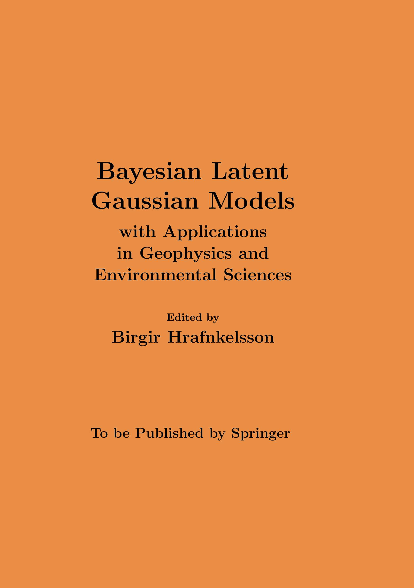

<br>
```{r out.width='30%', out.extra='style="float:right; padding:10px"',echo=F}

```
<!-- Here we provide links to the various github repositories where the code corresponding to each chapter can be found. -->

-------------------------

#### **Ch. 1** - *Bayesian latent Gaussian models*

Birgir Hrafnkelsson and Haakon Bakka

- [<font size="3">Section 4 - Code (Matlab)</font> ](https://github.com/hrafnkelsson/chapter1blgm)
- [<font size="3">Section 5 - Code (R)(TEMP)</font> ](https://github.com/haakonbakkagit/TEMP)
 
------------------------- 
 
#### **Ch. 2** - *A review of Bayesian modelling in glaciology*

Giri Gopalan, Andrew Zammit-Mangion, and Felicity McCormack

- [<font size="3">Section 3 - Code - GitHub repository (R)</font> ](https://github.com/ggopalan/SMB)
- [<font size="3">Section 4 - Code - Google site (R)</font> ](https://sites.google.com/view/rates-antarctica/home)

-------------------------

#### **Ch. 3** - *Bayesian discharge rating curves based on the generalized power law*

Birgir Hrafnkelsson, Rafael Daníel Vias, Sölvi Rögnvaldsson, Axel Örn Jansson, and Sigurdur M. Gardarsson

- [<font size="3">bdrc - GitHub repository (R)</font> ](https://github.com/sor16/bdrc)
- [<font size="3">bdrc - Shiny application</font> ](https://bdrc.shinyapps.io/bdrc)
- [<font size="3">bdrc - R package webpage</font> ](https://sor16.github.io/bdrc)

-------------------------

#### **Ch. 4** - *Bayesian modeling in engineering seismology: Ground-motion models*

Sahar Rahpeyma, Milad Kowsari, Tim Sonnemann, Benedikt Halldorsson, and Birgir Hrafnkelsson

- [<font size="3">Section 4.1 Code and synthetic data - GitHub repository (Matlab)</font> ](https://github.com/hjordislb/BHM2020)
- [<font size="3">Section 4.2 Code and synthetic data - GitHub repository (Matlab)</font> ](https://github.com/tsonne/bayes-empirical-gmm)
- [<font size="3">Section 4.3 Code and synthetic data - GitHub repository (Matlab)</font> ](https://github.com/tsonne/gmm-ranking-dic)

-------------------------

#### **Ch. 5** - *Bayesian modelling in engineering seismology: Spatial earthquake magnitude model*

Atefe Darzi, Birgir Hrafnkelsson, and Benedikt Halldorsson

- [<font size="3">Code and data - GitHub repository (Matlab)</font> ](https://github.com/hrafnkelsson/chapter5blgm)

-------------------------

#### **Ch. 6** - *Improving numerical weather forecasts by Bayesian hierarchical modelling*

Joshua Lovegrove and Stefan Siegert

- [<font size="3">Code and data - GitHub repository (R) (TEMP)</font> ](https://github.com/sieste/TEMP)

-------------------------

#### **Ch. 7** - *Bayesian latent Gaussian models for high-dimensional spatial extremes*

Arnab Hazra, Raphaël Huser, and Árni V. Jóhannesson

- [<font size="3"> Data </font> ](https://gpm.nasa.gov/data-access/downloads/trmm)
- [<font size="3"> Code - GitHub repository (R) </font> ](https://github.com/arnabstatswithR/max_and_smooth)