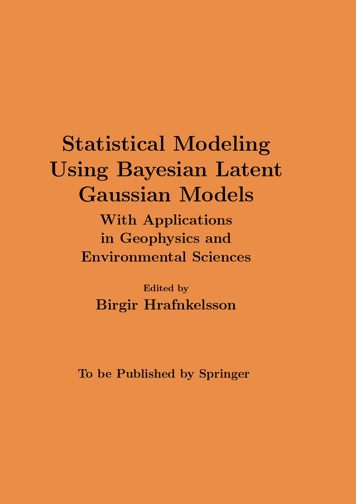

<br>
```{r out.width='30%', out.extra='style="float:right; padding:10px"',echo=F}

```
This book is on Bayesian latent Gaussian models and how to apply them to data in geophysics and environmental sciences. It is written for graduate students, researchers, and specialists, in geophysics, environmental sciences, statistics, and other related fields. The material of the book requires knowledge of calculus, linear algebra, probability and statistics.